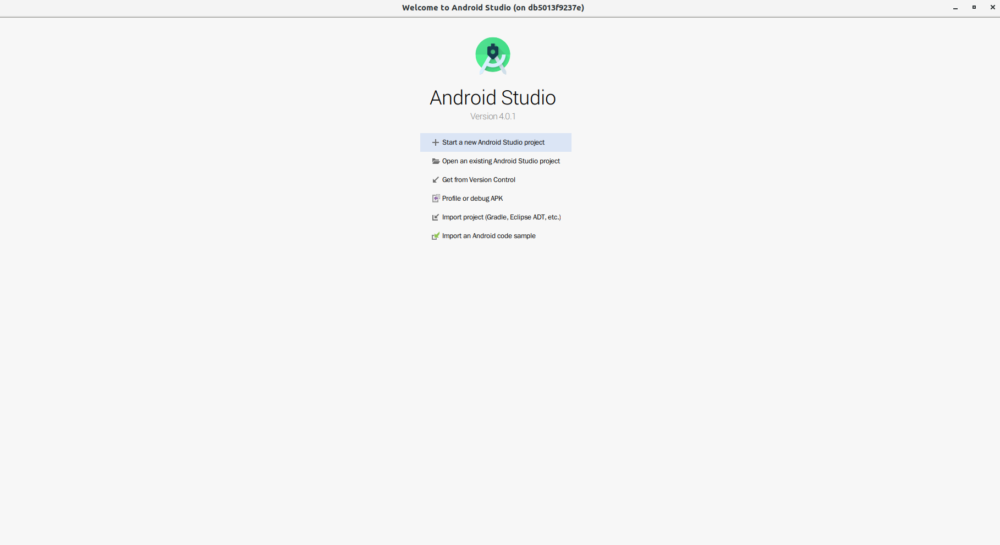

#x11Docker
目的是为了在沙箱 运行Android studio 类似的GUI 软件<br>
环境基于 [x11docker](https://github.com/mviereck/x11docker) <br>
镜像基于:[x11docker/lxde](https://hub.docker.com/r/x11docker/lxde)

### 环境准备
1. Docker 安装
2. 安装 x11docker
- git clone https://github.com/mviereck/x11docker.git
- 以root身份，可以在系统上安装，更新和删除x11docker：
- x11docker --install : 在当前目录安装x11docker和x11docker-gui。
- x11docker --update : 从github下载并安装最新版本。
- x11docker --update-master : 从github下载并安装最新的主版本。
- x11docker --remove : 删除x11docker安装的所有文件。


### 编辑docker file
手动下载 [JDK](https://www.oracle.com/sa/java/technologies/javase-downloads.html) <br>
```shell script
 37 ENV JAVA_HOME /usr/lib/jvm/java-${VERSION}-oracle
 38 ENV JRE_HOME ${JAVA_HOME}/bin
 39 
 40 COPY jdk-14.0.2_linux-x64_bin.tar.gz /tmp
 41 
 42 RUN cd /tmp && tar -zxvf jdk-14.0.2_linux-x64_bin.tar.gz && \
 43     mkdir -p "${JAVA_HOME}" && mkdir -p "${JRE_HOME}" && mv /tmp/jdk-14.0.2/* "${JAVA_HOME}" && \
 44     rm -rf /tmp/*
 45 
 46 RUN update-alternatives --install "/usr/bin/java" "java" "${JRE_HOME}/java" 1 && \
 47     update-alternatives --install "/usr/bin/javac" "javac" "${JAVA_HOME}/bin/javac" 1 && \
 48     update-alternatives --set java "${JRE_HOME}/java" && \
 49     update-alternatives --set javac "${JAVA_HOME}/bin/javac"
```
更新docker file.

### 编译 image
sudo docker build -t android-studio-zh .

### 运行
根据需求,修改挂载Home 目录, 以及share 目录
x11docker --xwin --desktop --dpi 150 --gpu --clipboard \
--home="/home/arvin/aosp/dockerHome/" --share="/home/arvin/code/ide/" \
--sudouser --no-internet --lang="zh_CN" --showid --  --  android-studio-zh

### 截图



### TODO
1. 不支持中文输入法
2. 直接使用docker运行:
   docker run --rm   -e DISPLAY=${DISPLAY}   -v /tmp/.X11-unix:/tmp/.X11-unix
3. 中文字体需要优化
4. 安装 chrome

